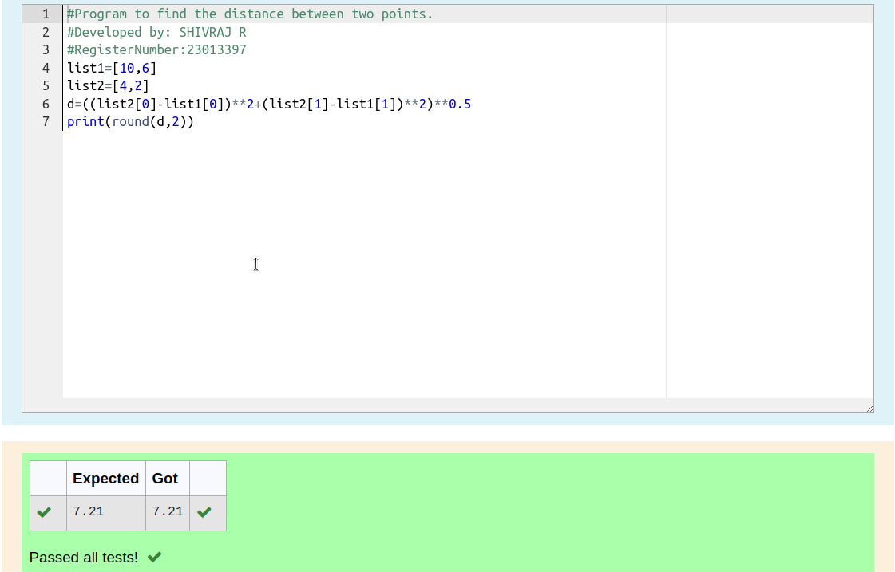

# DISTANCE-BETWEEN-TWO-POINTS

## AIM:
To write a python program to find the distance two 2 points
## ALGORITHM:
### Step 1: 
Program the code with list .

### Step 2: 
Print the the distance two points

### Step 3: 
Substitute the values in the distance formula  

### Step 4: 
Evaluate the a input.

### Step 5: 
Enter integer (n) in input.

### PROGRAM:
``````
#Program to find the distance between two points.
#Developed by: SHIVRAJ R
#RegisterNumber:23013397
list1=[10,6]
list2=[4,2]
d=((list2[0]-list1[0])**2+(list2[1]-list1[1])**2)**0.5
print(round(d,2))
``````


### OUTPUT:


### RESULT:
The output was verifed successfully.